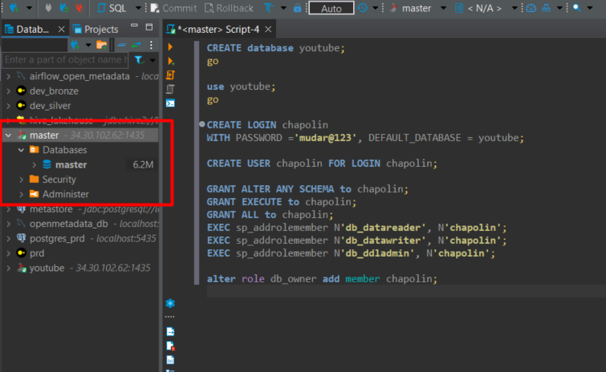

# SQL Server on Docker

## Tutorial

## Getting Started

    git clone https://github.com/wlcamargo/docker_sqlserver.git

## Install image

    docker-compose up -d

## Access Using Dbeaver

## Developer

[Wallace Camargo](https://www.linkedin.com/in/wallace-camargo-35b615171/) 

